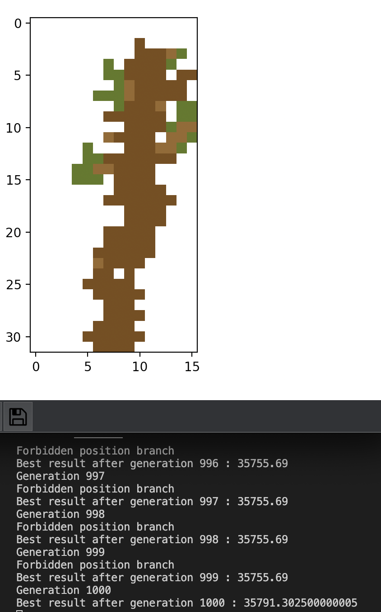
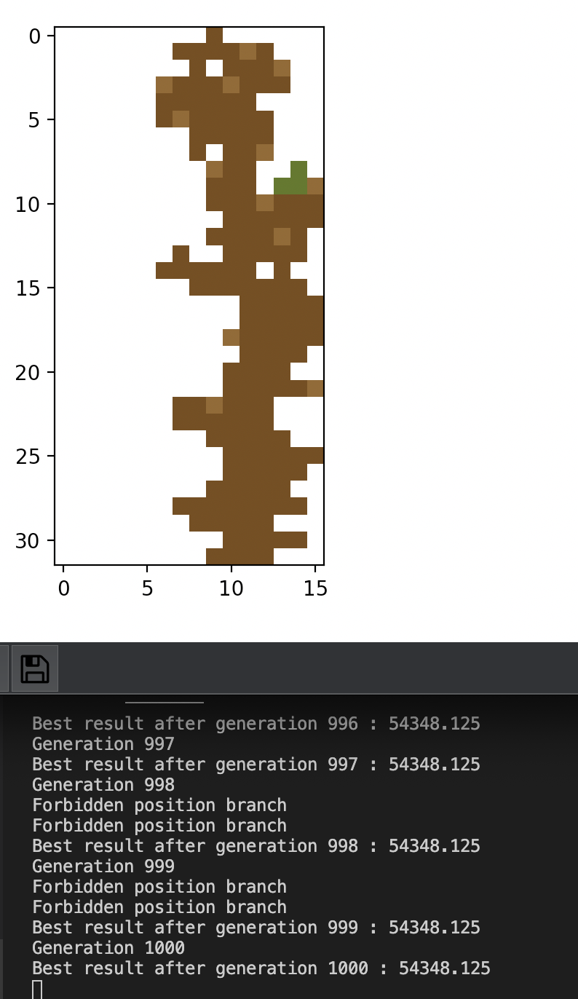

# genetic-algorithm-pixel-plant

## Run

To run the genetic algorithm do:
```sh
python3 optimal-pixel-plant.py
```

## Examples

* With 1000 generations and population size 10
  * 

* With 1000 generations and population size 30
  * 
